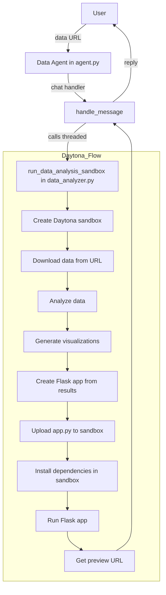
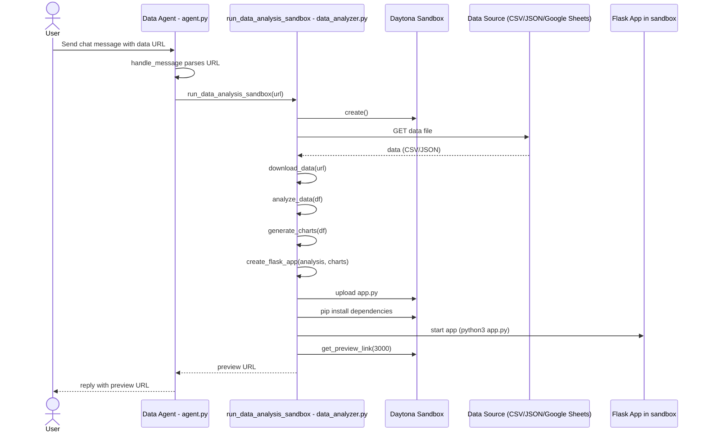

# Data Summarization Assistant (Daytona + Flask + uAgents)

[](https://fetch.ai)
[](https://github.com/fetchai/uAgents)
[](https://www.daytona.io)
[](#)


An AI-powered data summarization assistant that:
- Receives data file URLs (CSV or JSON, including Google Sheets) or raw data via chat
- Uses Daytona to spin up a secure sandbox environment
- Runs Python code to analyze the data (calculate averages, generate summary statistics)
- Produces text summaries and visualizations (charts, graphs)
- Returns a comprehensive report with charts via a Flask web preview

This example showcases how Daytona enables an agent to securely execute code, manipulate data files, and generate visualizations autonomously in a sandboxed environment, without requiring a complex setup. It is ideal for automating routine data analysis tasks safely and efficiently.

## 🚀 Quick Start

```bash
# Clone the repository
git clone https://github.com/gautammanak1/Data-Summarization-fetchai-daytona.git
cd Data-Summarization-fetchai-daytona

# Install dependencies
pip install -r requirements.txt

# Set up environment
echo "DAYTONA_API_KEY=your_key_here" > .env

# Run the agent
python3 agent.py
```

## Features

- 📊 **Automatic Data Analysis**: Downloads and analyzes CSV/JSON files
- 🔗 **Google Sheets Support**: Direct support for Google Sheets CSV export URLs
- 📈 **Visualizations**: Generates histograms, bar charts, and correlation heatmaps
- 📝 **Summary Reports**: Comprehensive statistical summaries and key insights
- 🔒 **Secure Execution**: Runs in isolated Daytona sandbox environment
- 🌐 **Web Preview**: Beautiful HTML report with interactive visualizations
- 🤖 **Agent Interface**: uAgents chat protocol for seamless integration

## Project Structure

- `data_analyzer.py`: Core logic. Downloads data, performs analysis, generates visualizations, creates Flask app, and deploys it in a Daytona sandbox.
- `agent.py`: uAgents chat agent. Receives data file URLs, calls `run_data_analysis_sandbox` from `data_analyzer.py`, and replies with the preview URL.

## Prerequisites

- Python 3.10+
- Daytona API key
- Data file URL (CSV or JSON, publicly accessible)

## Environment Variables

Create a `.env` file in the project root with:

```ini
DAYTONA_API_KEY=your_daytona_api_key
```

## Install Dependencies

```bash
python3 -m venv .venv
source .venv/bin/activate
pip install --upgrade pip
pip install -r requirements.txt
```

If `uagents-core` is unavailable on your index, try:
```bash
pip install uagents
```

## Run Modes

### A) Run the CLI flow (no agents)

This launches the Daytona sandbox and returns a live preview URL after you enter a data URL.

```bash
python3 data_analyzer.py
# Example prompt when asked:
#   https://docs.google.com/spreadsheets/d/YOUR_SHEET_ID/edit
#   or
#   https://example.com/data.csv
#   or use the sample file: sample_data.csv (local file path)
```

### B) Run the uAgents chat agent

This exposes the same capability behind a uAgents chat interface.

```bash
python3 agent.py
```

- The agent starts on port `8000` with a mailbox enabled. Send a `ChatMessage` containing your data file URL from another uAgent or an integration that speaks the uAgents chat protocol.

## Supported Data Sources

### Google Sheets

To use a Google Sheet:
1. Make sure the sheet is publicly accessible (View permissions)
2. Copy the share URL (e.g., `https://docs.google.com/spreadsheets/d/SHEET_ID/edit`)
3. The system will automatically convert it to CSV export format

### CSV Files

Any publicly accessible CSV file URL:
- `https://example.com/data.csv`
- Direct download links

### JSON Files

Any publicly accessible JSON file URL:
- `https://example.com/data.json`
- API endpoints returning JSON arrays or objects

## High-Level Workflow

### Workflow
- User sends a data file URL (CSV/JSON/Google Sheets)
- Agent triggers sandbox data analysis and web preview creation
- Data is downloaded, analyzed, and visualized
- Flask app with formatted results runs inside Daytona sandbox
- Agent replies with preview URL containing the full report

### Flowchart


### Sequence Diagram


## Analysis Features

The assistant performs comprehensive data analysis:

### Statistical Analysis
- Summary statistics (mean, median, std dev, min, max)
- Distribution analysis
- Correlation analysis
- Missing value detection

### Visualizations
- **Histograms**: Distribution of numeric columns
- **Bar Charts**: Top values in categorical columns
- **Correlation Heatmaps**: Relationships between numeric variables

### Insights
- Data shape and structure
- Column types and distributions
- Missing data patterns
- Key statistics and trends

## 📊 Example Output

### Input Data (CSV)
```csv
Product,Category,Sales,Revenue,Units_Sold,Region,Quarter
Laptop,Electronics,1500,225000,150,North,Q1
Smartphone,Electronics,2000,300000,200,North,Q1
Tablet,Electronics,800,120000,80,North,Q1
```

### Generated Report Includes:
1. **Data Overview**: Total rows, columns, data types
2. **Summary Statistics**: Mean, median, std dev, min, max for numeric columns
3. **Missing Values Analysis**: Identification of incomplete data
4. **Key Insights**: Statistical analysis and patterns
5. **Visualizations**:
   - Histograms for numeric columns
   - Bar charts for categorical columns
   - Correlation heatmaps for numeric relationships

### Preview URL Output
After processing, you'll receive a preview URL like:
```
https://3000-xxxxx-xxxxx-xxxxx.proxy.daytona.works
```

This URL opens a beautiful web report with:
- Modern gradient design
- Interactive charts and visualizations
- Comprehensive data analysis
- Downloadable insights

## 📸 Sample Output Screenshot

The web report displays:
- **Header**: Data Analysis Report title
- **Data Source**: Link to original data
- **Data Overview**: Dataset dimensions and structure
- **Summary Statistics Table**: Statistical metrics for numeric columns
- **Missing Values**: Identification of gaps in data
- **Key Insights**: Automated insights and patterns
- **Visualizations**: Multiple charts and graphs
- **Footer**: Powered by Daytona & Fetch.ai

## Usage Tips

- **Google Sheets**: Ensure the sheet is publicly accessible or shared with view permissions
- **Large Files**: The system handles reasonable-sized datasets. Very large files may take longer to process
- **502 Errors**: If the preview initially returns 502, wait a few seconds and refresh; the app may still be warming up
- **Data Format**: Ensure your CSV/JSON is well-formed for best results
- **Local Files**: Use absolute file paths for local CSV/JSON files
- **Raw Data**: You can paste CSV/JSON data directly in the chat message

## Example URLs

### Google Sheets
```
https://docs.google.com/spreadsheets/d/1BxiMVs0XRA5nFMdKvBdBZjgmUUqptlbs74OgvE2upms/edit
```

### CSV File
```
https://raw.githubusercontent.com/datasets/covid-19/main/data/time-series-19-covid-combined.csv
```

### JSON File
```
https://api.github.com/repos/octocat/Hello-World/issues
```

## Troubleshooting

- **"DAYTONA_API_KEY environment variable not set"**: Add it to `.env` or your shell env
- **502 / cannot connect**: Give the sandbox ~30–45 seconds; ensure port `3000` is used in the preview URL
- **"Could not download data"**: Check that the URL is publicly accessible and the file format is supported
- **"No numeric columns found"**: The dataset may only contain text data. The system will still analyze categorical columns
- **Charts not displaying**: Ensure matplotlib backend is set correctly (handled automatically)

## Security Notes

- Do not commit real API keys. Use `.env` locally and a secret manager in CI/CD
- Data is processed in an isolated Daytona sandbox
- Only publicly accessible data URLs should be used
- Sandbox is automatically cleaned up after use

## 🎯 Use Cases

1. **Sales Data Analysis**: Analyze sales performance, revenue trends, and product metrics
2. **Customer Data**: Understand customer demographics and behavior patterns
3. **Financial Data**: Track expenses, revenues, and financial metrics
4. **Survey Results**: Analyze survey responses and generate insights
5. **Performance Metrics**: Monitor KPIs and performance indicators
6. **Research Data**: Analyze experimental data and research findings

## 🔧 Technical Details

### Data Processing Pipeline
1. **Data Loading**: Supports URLs, local files, and raw text
2. **Data Validation**: Automatic format detection (CSV/JSON)
3. **Data Analysis**: Statistical analysis and pattern detection
4. **Visualization**: Automatic chart generation based on data types
5. **Report Generation**: HTML report with embedded charts
6. **Sandbox Deployment**: Secure execution in Daytona environment

### Supported Data Types
- **Numeric**: Integers, floats (analyzed with statistics)
- **Categorical**: Strings, text (analyzed with value counts)
- **Complex**: Dicts, lists (identified but not analyzed in detail)
- **Dates**: Detected and handled appropriately

### Chart Types Generated
- **Histograms**: Distribution analysis for numeric columns
- **Bar Charts**: Frequency analysis for categorical columns
- **Correlation Heatmaps**: Relationship analysis between numeric variables

## 📝 Example Workflow

1. **Start Agent**:
   ```bash
   python3 agent.py
   ```

2. **Send Data** (via uAgents chat or direct input):
   ```
   https://docs.google.com/spreadsheets/d/YOUR_SHEET_ID/edit
   ```

3. **Receive Response**:
   ```
   ✅ Data analysis complete!
   
   📊 Preview URL: https://3000-xxxxx.proxy.daytona.works
   
   The analysis includes:
   - Summary statistics
   - Key insights
   - Standard visualizations (histograms, bar charts, correlation heatmaps)
   
   Open the URL to view the full report.
   ```

4. **View Report**: Open the preview URL in your browser to see:
   - Complete data analysis
   - Interactive charts
   - Downloadable insights

## 🤝 Contributing

Contributions are welcome! Please feel free to submit a Pull Request.

## 📄 License

This project is provided as an example implementation.

## 🔗 Links

- [Daytona](https://www.daytona.io)
- [Fetch.ai](https://fetch.ai)
- [uAgents](https://github.com/fetchai/uAgents)
- [Repository](https://github.com/gautammanak1/Data-Summarization-fetchai-daytona)

